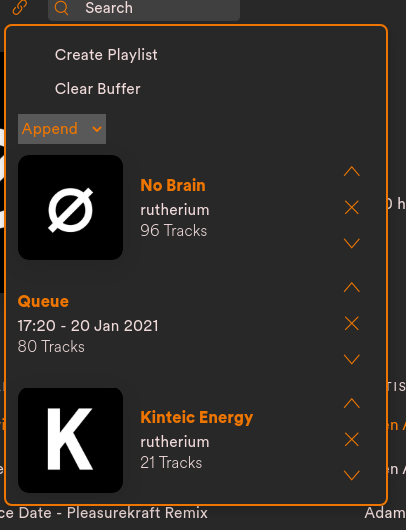

# Spicetify Copy

Spicetify Extension which allows you to copy playlists directly in Spotify

## Preview
Copy a single playlist:  


Combine multiple playlist to a single big playlist:  


## Installation
* Download and install [Spicetify](https://github.com/khanhas/spicetify-cli.git)
* Add the [copyPlaylist.js](copyPlaylist.js) file to the Extensions folder (spicetify-cli/Extensions)
* Add the extension to the `config.ini` file
```shell
spicetify config extensions copyPlaylist.js
spicetify apply
```
## Important
When creating a new Playlist you **MUST** to use the `Create` button, otherwise an empty playlist will be created.